    

        
    

# **`Awesome`** [Powershell](https://github.com/cybersecurity-dev/PowerShell-Toolkit) [Scripting](https://wikipedia.org/wiki/PowerShell) Resources 

 

    
    &nbsp;
    
    &nbsp;
    
    

```mermaid
flowchart TD

    PST[PowerShell Development Toolkit]

    PST --> CORE[Core Language]
    PST --> IDE[Development Environment]
    PST --> MOD[Modules]
    PST --> DEBUG[Debugging]
    PST --> TEST[Testing]
    PST --> AUTOM[Automation]
    PST --> CLOUD[Cloud & DevOps]
    PST --> SEC[Security]

    CORE --> C1[PowerShell 7]
    CORE --> C2[Cmdlets]
    CORE --> C3[Functions]
    CORE --> C4[Objects & Pipelines]

    IDE --> I1[VS Code]
    IDE --> I2[PowerShell Extension]
    IDE --> I3[PowerShell ISE]

    MOD --> M1[PSGallery]
    MOD --> M2[Custom Modules]
    MOD --> M3[Module Manifest]

    DEBUG --> D1[Breakpoints]
    DEBUG --> D2[Tracing]
    DEBUG --> D3[Verbose Logging]

    TEST --> T1[Pester]
    TEST --> T2[Mocking]
    TEST --> T3[Code Coverage]

    AUTOM --> A1[Task Scheduler]
    AUTOM --> A2[Remoting]
    AUTOM --> A3[Desired State Configuration]

    CLOUD --> CL1[Azure]
    CLOUD --> CL2[Azure Automation]
    CLOUD --> CL3[GitHub Actions]

    SEC --> S1[Execution Policy]
    SEC --> S2[Code Signing]
    SEC --> S3[JEA]
    SEC --> S4[Secret Management]

    style PST fill:#333333,stroke:#000000,color:#ffffff

    style CORE fill:#0b5394,stroke:#073763,color:#ffffff
    style IDE fill:#674ea7,stroke:#351c75,color:#ffffff
    style MOD fill:#6aa84f,stroke:#38761d,color:#ffffff
    style DEBUG fill:#e69138,stroke:#b45f06,color:#ffffff
    style TEST fill:#f1c232,stroke:#bf9000,color:#000000
    style AUTOM fill:#990000,stroke:#660000,color:#ffffff
    style CLOUD fill:#008080,stroke:#005555,color:#ffffff
    style SEC fill:#434343,stroke:#222222,color:#ffffff
```

## 📖 Contents
- [Books](#books)
- [Videos](#videos)
- [My Other Awesome Lists](#my-other-awesome-lists)
- [Contributing](#contributing)
- [Contributors](#contributors)

### Books

### Videos
- [PowerShell Unit and Infrastructure Testing by Jaap Brasser, Justin Grote](https://youtu.be/q88Aq9suw2w?si=02Pk_xKM-U62h9fv)

##

### My Other Awesome Lists
You can access the my other awesome lists [here](https://cyberthreatdefence.com/my_awesome_lists)

### Contributing
[Contributions of any kind welcome, just follow the guidelines](contributing.md)!

### Contributors
[Thanks goes to these contributors](https://github.com/cybersecurity-dev/awesome-powershell-scripting-resources/graphs/contributors)!

### License

[🔼 Back to top](#awesome-powershell-scripting-resources-)
